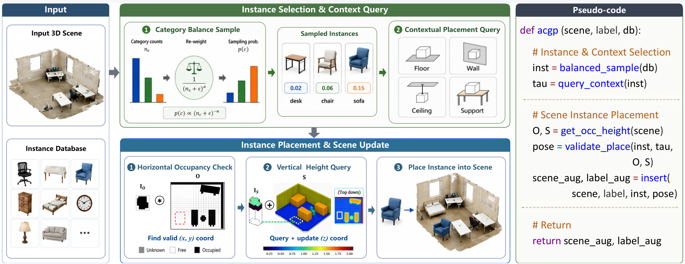

<h1 align="center">Beyond Context Bias: Adaptive Instance
Placement for Robust 3D Instance Segmentation</h1>

<p align="center">
  <a href="#">Paper</a>
  ·
  <a href="https://yangrongkun.github.io/">Project Page</a>
  ·
  <a href="#citation">BibTeX</a>
</p>

<p align="center">
  This repository contains the official implementation of Adaptive Instance Placement for Robust 3D Instance Segmentation (ACGP).
</p>

<p align="center">
  
</p>

<p align="center">
  <strong>Overall framework of ACGP.</strong> Given a 3D scene and an instance database, ACGP selects instances via category-balanced sampling, queries their category-conditioned placement types, and places them at geometrically valid locations using occupancy- and support-aware validation to generate augmented scenes. <strong>The pseudo-code</strong> on the right summarizes the complete pipeline of instance-level augmented scene generation.
</p>

<p align="center">
  The core ACGP instance placement implementation can be found in
  <a href="pointcept/datasets/instance_augmentor_occupancy.py"><code>pointcept/datasets/instance_augmentor_occupancy.py</code></a>.
</p>

## 📢 News


<details>
<summary><b>Update:  ACGP achieves the SOTA performance on ScanNet200 test set for 3D instance segmentation benchmark. Test scores accessed on 12 July, 2026. <a href="https://kaldir.vc.in.tum.de/scannet_benchmark/scannet200_semantic_instance_3d" target="_blank">ScanNet200 test set</a> </b> (The results are provided by official based on this repo)</summary>


</details>


<details>
<summary><b>ACGP achieves the SOTA performance on ScanNet++ V2 test set for 3D instance segmentation. Test scores accessed on 10 July, 2026. <a href="https://kaldir.vc.in.tum.de/scannetpp/benchmark/insseg" target="_blank">ScanNet++ V2 test set</a></b> </summary>
</details>


## :floppy_disk: ACGP Trained Results
| Model | Benchmark | mAP | AP50 | AP25 | Tensorboard | Exp Record | Model |
| :---: | :---: | :---: | :---: | :---: | :---: | :---: | :---: |
| SGIFormer | ScanNet++ V2 Test | 29.9 | 45.7 | - | - | - | - |
| SGIFormer | ScanNet++ Val | 23.9 | 37.5 | - | [Link](https://huggingface.co/RayYoh/SGIFormer/tensorboard) | [Link](https://huggingface.co/RayYoh/SGIFormer/raw/main/insseg-scannetpp-sgiformer-spunet/train.log) | [Link](https://huggingface.co/RayYoh/SGIFormer/blob/main/insseg-scannetpp-sgiformer-spunet/model/model_best.pth) |
| SGIFormer | ScanNet Val | 58.9 | 78.4 | - | - | [Link](https://huggingface.co/RayYoh/SGIFormer/raw/main/insseg-scannet-sgiformer-spunet/train.log) | [Link](https://huggingface.co/RayYoh/SGIFormer/blob/main/insseg-scannet-sgiformer-spunet/model/model_best.pth) |
| SGIFormer-L | ScanNet Val | 61.0 | 81.2 | - | - | [Link](https://huggingface.co/RayYoh/SGIFormer/raw/main/insseg-scannet-sgiformer-l-spunet/train.log) | [Link](https://huggingface.co/RayYoh/SGIFormer/blob/main/insseg-scannet-sgiformer-l-spunet/model/model_best.pth) |
| SGIFormer | ScanNet200 Val | 28.9 | 38.6 | - | - | [Link](https://huggingface.co/RayYoh/SGIFormer/raw/main/insseg-scannet200-sgiformer-spunet/train.log) | [Link](https://huggingface.co/RayYoh/SGIFormer/blob/main/insseg-scannet200-sgiformer-spunet/model/model_best.pth) |
| SGIFormer-L | ScanNet200 Val | 29.2 | 39.4 | - | - | [Link](https://huggingface.co/RayYoh/SGIFormer/raw/main/insseg-scannet-sgiformer-l-spunet/train.log) | [Link](https://huggingface.co/RayYoh/SGIFormer/blob/main/insseg-scannet-sgiformer-l-spunet/model/model_best.pth) |


## Setup

This repository is built on top of [Pointcept](https://github.com/Pointcept/Pointcept/blob/04a0232b70f5c7091ffdc6bfe7a476e3eb7daff2) and incorporates components from [SGIFormer](https://github.com/RayYoh/SGIFormer/blob/4c05d57bbbd676b6a2398b03deac916e603a9dd7) and [Volt](https://github.com/YilmazKadir/Volt) for instance segmentation. 

### Dependencies
We recommend using [`uv`](https://docs.astral.sh/uv/#highlights), a fast Python package and environment manager, to install the environment.

To install `uv` on macOS and Linux, run:
```bash
curl -LsSf https://astral.sh/uv/install.sh | sh
```

Then set up the environment with:
```bash
# Make sure to load CUDA 12.6 beforehand
# This will automatically create a virtual environment (.venv) and install dependencies from pyproject.toml
uv sync
source .venv/bin/activate
```

## Data Preprocessing
Follow the dataset setup instructions in the [Pointcept README](https://github.com/Pointcept/Pointcept/blob/04a0232b70f5c7091ffdc6bfe7a476e3eb7daff2/README.md).

### Indoor Datasets
Preprocessing for indoor datasets is identical to Pointcept.

### Outdoor Datasets
Preprocessing for outdoor datasets is identical to ISBNet.


### Instance Segmentation

First, run the preprocessing script to generate superpoints for ScanNet and ScanNet200.
```bash
python pointcept/datasets/preprocessing/scannet/preprocess_superpoints.py --dataset_root ${RAW_SCANNET_DIR} --output_root ${PROCESSED_SCANNET_DIR}
```

Download the pretrained Volt-S backbone weights from [HuggingFace](https://huggingface.co/KadirYilmaz/Volt/tree/main)
```bash
mkdir -p weights
curl -L -o weights/volt-small-scannet.pth https://huggingface.co/KadirYilmaz/Volt/resolve/main/Volt_experiments/joint_training_small/scannet/model/model_last.pth
curl -L -o weights/volt-small-scannet200.pth https://huggingface.co/KadirYilmaz/Volt/resolve/main/Volt_experiments/joint_training_small/scannet200/model/model_last.pth
```
Alternatively you can train them yourself using the corresponding configs above.

Then, run the training script with the `insseg-spformer-volt-S-0-base` config for scannet/scannet200

```bash
### ScanNet
sh scripts/train.sh -g 4 -d scannet -c insseg-spformer-volt-S-0-base -n insseg-volt
### ScanNet200
sh scripts/train.sh -g 4 -d scannet200 -c insseg-spformer-volt-S-0-base -n insseg-volt
```

<!-- ## Model Zoo

We provide the experiment directories, including configs, logs, and checkpoints. The experiments can also be seen from [Hugging Face](#).

### 3D Instance Segmentation: Baseline Training

| Model | Dataset | Val mAP | Exp. Dir |
| :--- | :--- | :---: | :---: |
| Volt-S | ScanNet | 76.3 | [link](#) |
| Volt-S | ScanNet200 | 36.1 | [link](#) |
| Volt-S | ScanNet++ | 50.2 | [link](#) |


### 3D Instance  Segmentation: ACGP Training

| Model | Dataset | Val mAP | Exp. Dir |
| :--- | :--- | :---: | :---: |
| Volt-S | ScanNet | 80.2 | [link](#) |
| Volt-S | ScanNet200 | 38.5 | [link](#) |
| Volt-S | ScanNet++ | 50.2 | [link](#) | -->

## Citation

If you use our work in your research, please use the following BibTeX entry.

```

```


## Acknowledgements
Code is built based on [Volt](https://github.com/YilmazKadir/Volt), [PointCept](https://github.com/Pointcept/Pointcept), and [SGIFormer](https://github.com/RayYoh/SGIFormer). We sincerely thank the authors for sharing their code.


